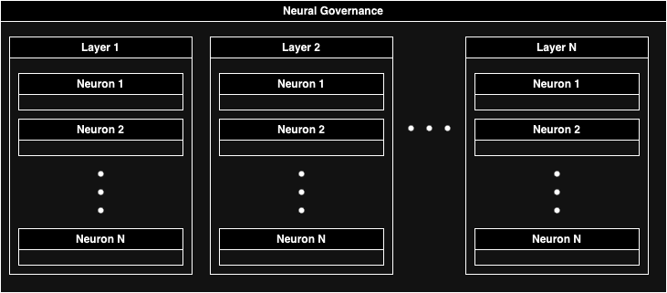

# NQG

This contract is a part of implementation of
the [Neural Quorum Governance](https://stellarcommunityfund.gitbook.io/module-library) mechanism.



Currently, because
of [resource constraints](https://developers.stellar.org/docs/reference/resource-limits-fees#resource-limits) and to
preserve voter privacy, neurons are computed off-chain and uploaded to the contract.

The contract adds up results of each layer and computers the final voting power for each voter. This voting power is
stored on-chain for future reference.

This voting power is used to compute the final score for each submission: Each `Yes` and `No` vote is multiplied by
respective users voting powers and tallied.

Contract is also a part of Soroban Governor DAO system. Voting powers of users are used as SCF Token balances (votes), which are then used to vote on proposals in the DAO.

## Release 

Governance releases are built by the
[`governance-release.yml`](../../.github/workflows/governance-release.yml) GitHub Actions workflow. Pushing a Git tag
starting with `v` triggers the workflow. It builds and optimizes the WASM, publishes it in a GitHub Release, and
submits the WASM hash and source commit for StellarExpert validation.

The version in [`Cargo.toml`](Cargo.toml) should match the Git tag without the `v` prefix. For example:

```text
Cargo.toml: version = "1.0.3"
Git tag:    v1.0.3
WASM:       governance_v1.0.3.wasm
```

If the versions do not match, the build still works, but the generated release tag includes both versions, for
example `v1.0.3_contracts_governance_pkg0.1.0_cli27.0.0`.

### Release flow

1. Update the contract version in `contracts/governance/Cargo.toml` and commit `Cargo.lock` if it changes.
2. Make sure all contract changes are committed and merged into `main`.
3. Create a tag matching the version from `Cargo.toml`:

   ```bash
   git tag v1.0.3
   ```

4. Push the tag:

   ```bash
   git push origin v1.0.3
   ```

5. GitHub Actions builds the optimized WASM, creates the GitHub Release, and validates the source and WASM hash.
   After a successful release, the workflow removes the short trigger tag and keeps the generated release tag.
