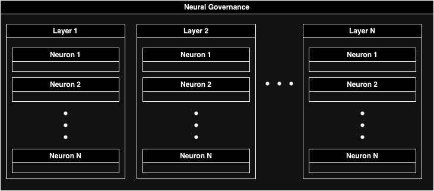

# NQG

This contract is a part of implementation of
the [Neural Quorum Governance](https://stellarcommunityfund.gitbook.io/module-library) mechanism.

Currently, because
of [resource constraints](https://developers.stellar.org/docs/reference/resource-limits-fees#resource-limits) and to
preserve voter privacy, neurons are computed off-chain and uploaded to the contract.

The contract adds up results of each layer and computers the final voting power for each voter. This voting power is
stored on-chain for future reference.

This voting power is used to compute the final score for each submission: Each `Yes` and `No` vote is multiplied by
respective users voting powers and tallied.

