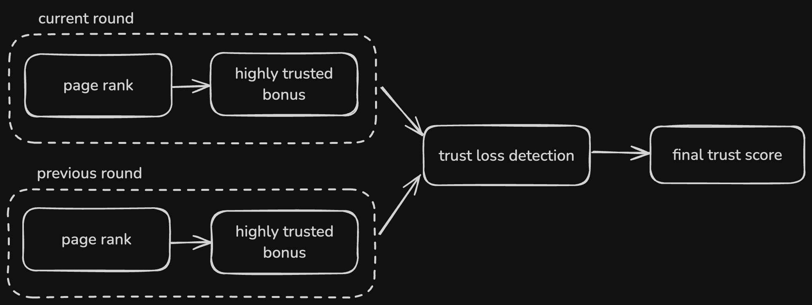

# Neurons

This code is an implementation of `neurons`
from the [Neural Quorum Governance](https://stellarcommunityfund.gitbook.io/module-library). 
There are some additional mechanisms added after the initial implementation:
- Trust Graph Neuron additionaly takes into account trust score gain or loss between previous and current round.
- Prior Voting History Neuron uses logistic function to determine the bonus, instead of original linear solution. (right now users who were active more recently get bigger bonus)

The data computed by this package is uploaded to the voting contract.

This is the source code used to calculate voting powers for each neuron used in NQG mechanism.
It also normalized the votes of voters (converts delegations to final votes) for them to be uploaded to the contract.

## Inputs

Neurons expect the inputs to be provided in `json` format. The inputs are loaded from `data/` directory.

## Outputs

Computed results of each neuron and normalized votes are written to `result/` directory.

## Running

```shell
cargo run
```

## Neurons

### Assigned Reputation Neuron

Assigns voting power based on voter discord rank.

### Prior Voting History Neuron

Assigns voting power based on rounds voter previously participated in. 
Having participated in most recent rounds have greater impact on the bonus, than rounds that were long time ago.
This way users who are inactive slowly loose their bonus, allowing for new, more active users to catch up.

### Trust Graph Neuron

Assigns voting power based on the amount of users trusting given voter. Each user can select other voters as trusted.
Final trust score calculation is done in 3 steps:
1. min-max normalized PageRank algorithm to compute the initial score (scaled to **0–10**).
2. voters trusted by users considered highly trusted (top **10%** of scores from page rank) get an additional bonus of **15%** of their own score, once per highly trusted truster. The total gain from this bonus is passed through a logistic curve `20 * tanh(gain / 20)` that is identity-like for small gains and saturates at **20**, so stacked bonuses can't compound into an unbounded score. The PageRank base score is not squashed.
3. voters who filled their own trust list get an additional bonus of **10%** of their own score.

Loss of trust between rounds is handled by the separate Trust Loss Neuron: if voters who trusted someone in the previous round drop them from their lists, a share of that person's total NQG score (logistic in the untrusting voters' NQG sum) is subtracted. As a safeguard, this only happens when at least **3 different** users revoked trust, regardless of how much NQG the revokers hold. This creates a penalty for users the community no longer considers trustworthy.


## Development

### Running Tests

```shell
cargo test
```

### Running Lint

```shell
cargo lint
```

This is an alias to `cargo clippy` with special config. See `.cargo/config.toml` for more details.

### Formatting

```shell
cargo fmt
```
